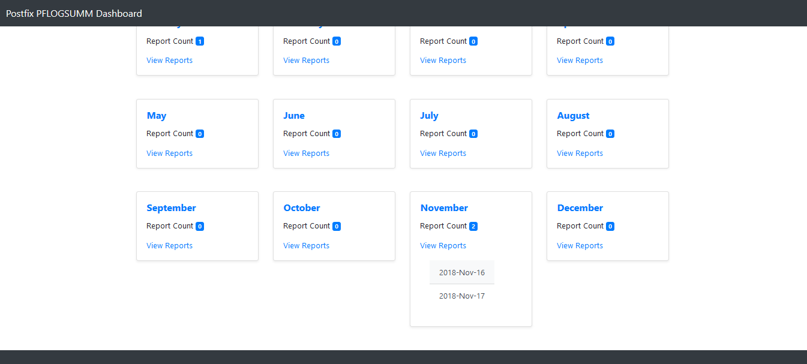
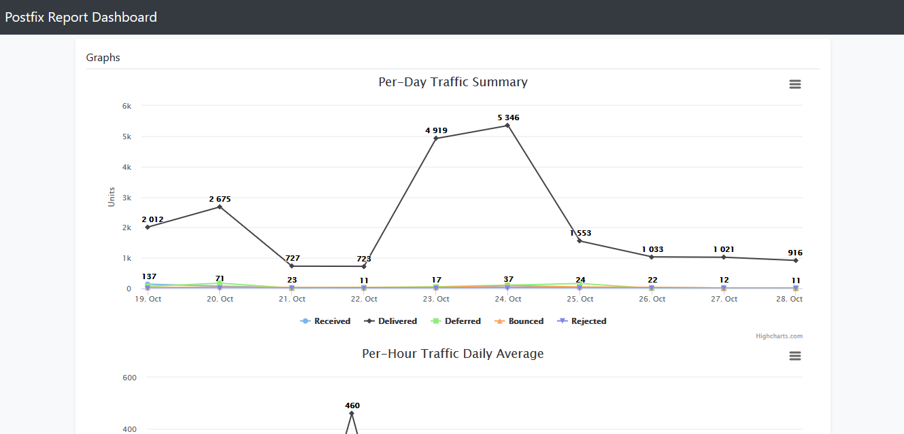

# PFLogSumm-HTML-GUI
Bash shell script to Generate POSTFIX statistics HTML report using pflogsumm as the backend

The script processes the pflogsumm output to an easy to view HTML report

## Screenshots of the web interface






## Requirements 

*pflogsumm* needs to be installed

## Script installation

Download the script to a location of your choice. Make the script executable as the root user using chmod +x pflogsummUIReport.sh
The script is self-contained the HTML is embedded inside the script.

## Configuration

Currently the script needs to be edited directly, working on creating a configuration file next

There are 4 variables that need to be set

```
LOGFILE="maillog*"
PFLOGSUMMBIN="/usr/sbin/pflogsumm --verbose_msg_detail --zero_fill "
HTMLOUTPUTDIR="/var/www/html/"
HTMLOUTPUTFILENAME="index.html"
```

*LOGFILE* location example: /var/log/maillog or /var/log/mail.log. *Notice the * at the end*. That means ALL logs files
*PFLOGSUMMBIN* location. If the script is in your path you can just add the name. DO NOT remove the options at the end
*HTMLOUTPUTDIR* location. Where would you like the generated HTML file to be saved on your system?
*HTMLOUTPUTFILENAME* file name. What would you like the file to be saved as? the default is index.html

## Create a crontab 

You can create a crontab entry depending on your system log sizes. For busy systems I recommend once every hour otherwise 30 min intervals should work.

### Example crontab entry

```
*/30 * * * * /opt/pflogsummUIReport.sh >/dev/null 2>&1
```

# WARNING: DO NOT upload the generated HTML file to a public server without password protection. User email addresses will be exposed to the internet
